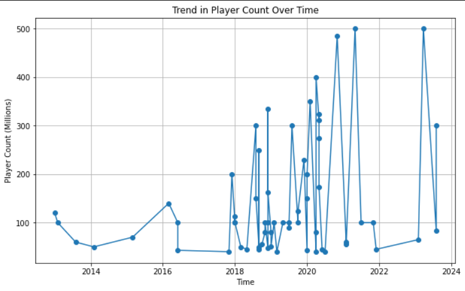

## Comprehensive Analysis of Web-Scraped Data on the Most Played Mobile Games

### Introduction:

I scraped some web data from Wikipedia about most played mobile games with respect to player count, capturing details on various mobile games and player count. Then i decided to perform EDA on this information to explore player counts for different games, unveil the correlation between player engagement and release dates, top developers, and find the secrets behind game longevity.

Webpage Link: https://en.wikipedia.org/wiki/List_of_most-played_mobile_games_by_player_count

You can view my work over here: <a href="https://github.com/Swapppyy/Analysis-on-most-played-mobile-games/blob/main/Web%20Scraping%20project.ipynb" target="_blank"><code>My Jupyter Notebook</code></a>

  
### Aim of this Notebook is to find:

- Trend in Player count over time

- Average player count by Publisher
  
- Correlation between Player count and Release date
  
- Seasonal Trends in Player engagement
  
- Top publishers and player count
  
- Players who are still playing the game since it was released (game longevity)
  
### My Insights:

It is important to note that the insights derived from this project may be inaccurate. The reason for this innacuracy lies in the relatively limited volume of data obtained through web scraping efforts. The smaller dataset size may impact the precision of our findings

- Significant increase in the player count is seen from the year 2020 to 2023

- Activision, King and Innersloth are the top 3 game developers with max average player count

- June, August and October are the prime months where the game which was released had a good amount of player count

- It is difficult to understand the exact month and the year for the correlation of the release date and player count because the data i have scraped is just less

- Playrix, Rovio and Tencent games are the top devs which have the max player count

- It can be observed that the games are played by most of the players upto 2000 days

 

### Trend pattern seen for players:

  

    

